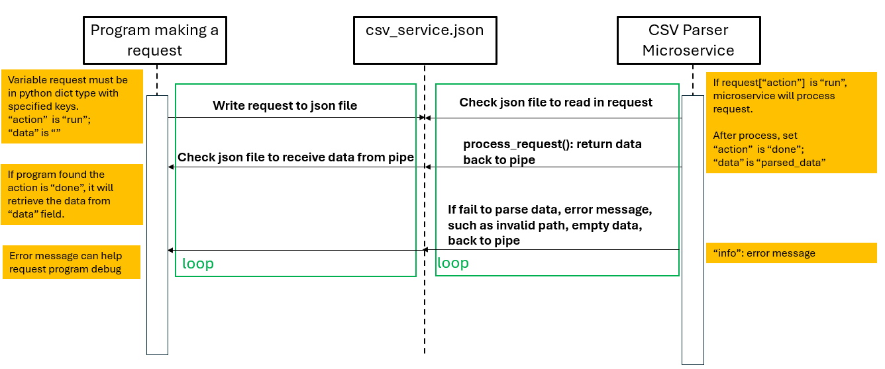

# CS361_2025_winter_project

## Microservice A: CSV Parser Microservice
This microservice can help user parse data from specified csv file. The microservice allows user to parse data stored in csv format and convert it into JSON format for the user. 
Additionally, the microservice can also convert input CSV file into JSON and TXT format and save it at specified location.

### Communication contract
1. This microservice receive request from a json file as pipeline(csv_service.json), return the parsed data through same json file.
2. This microservice must be deployed locally so that you can use it. Please download folder microserviceA into local.

### How to programmatically REQUEST data
To request data from the microservice, you need to send the request into the pipeline csv_service.json. The microservice listen to this json
file. Once request with proper action, csv file, and other options, is received, the microservice will process the request and parse the data.

<pre>
Example Request:
my_request = {
        "action": "run",
        "csv_file_path": "./data/people.csv",
        "output_format": "json",
        "output_path": "./data/people.json",
        "data": "",
        "info": ""}
 request parameters: 
        -action: "run", "done"(after service process)
        -csv_file_path: csv file to be parsed
        -data: parsed data
        -info: error information. If successfully, info = ""

Besides response from service, user can additionaly request the parsed data is writen into json/txt/csv file
-output_format: json/txt/csv
-output_path: additional ouput file path       
</pre>        

### How to programmatically RECEIVE data
The microservice once receive the request, process the request. It will return the parsed data back into pipeline file.
The request program check the pipeline file and retrieve the data.

<pre>
Example Receive:

This function help put request into pipeline, and retrieve data from pipeline
def request_service(request):
    pipe_file = "csv_service.json"
    with open(pipe_file, "w") as f:
        json.dump(request, f, indent=4)
    time.sleep(1)
    with open(pipe_file, "r") as f:
        request = json.load(f) 
    return request

Get response and print data
response = request_service(my_request)
if response["action"] == "done":
    print("...")
    print("Data is received successfully!")
    print(response["data"])       
</pre>

### UML sequence diagram

